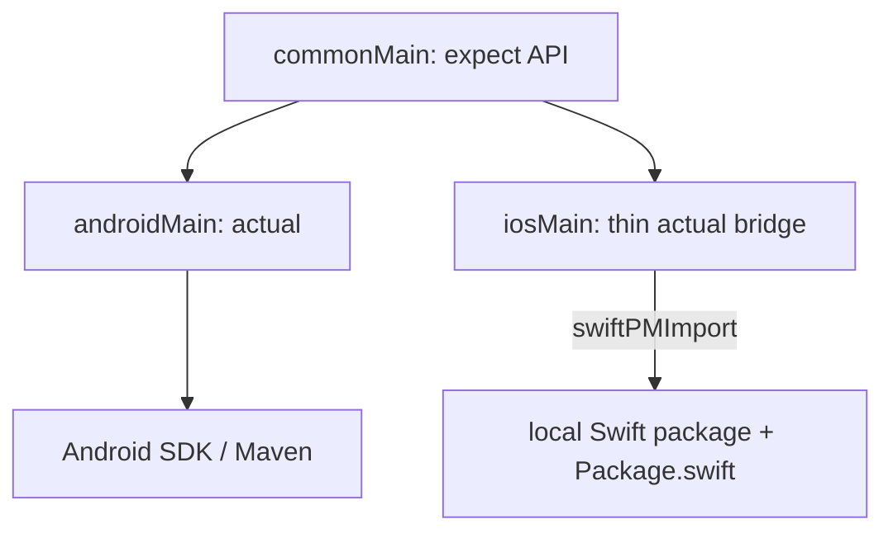

[//]: # (title: Build multipurpose shared modules with native platform code)

<web-summary>
Learn how to structure a Kotlin Multiplatform module so it ships a shared API, keeps iOS code in Swift via SwiftPM import, and remains usable as both a KMP library and a standalone Swift package.
</web-summary>

<show-structure depth="2"/>

You can structure a Kotlin Multiplatform module so that one repository serves two audiences at once:

* **Kotlin Multiplatform consumers** depend on a shared API from `commonMain` and get Android and iOS implementations through the usual Gradle / framework pipeline.
* **Native Swift consumers** depend on the same iOS sources through a root `Package.swift`, without going through Kotlin at all.

The idea is to share the contract in Kotlin, keep rich iOS behavior in idiomatic Swift, and implement Android with the platform SDK in Kotlin — instead of rewriting Apple frameworks as Kotlin/Native in `iosMain`.

> The iOS half of this pattern relies on [SwiftPM import](multiplatform-spm-import.md) (`swiftPMDependencies`), available since Kotlin **%kotlinVersion%** and currently in [Alpha](https://kotlinlang.org/docs/components-stability.html#stability-levels-explained).
>
{style="note"}

## Why multipurpose modules help teams

Platform specialists can own the code they know best:

* Kotlin engineers define the cross-platform API (`expect` declarations and shared types) and keep a thin `iosMain` bridge in sync with that API.
* iOS engineers implement behavior in Swift under a normal `Package.swift` tree, using `@objc` where Kotlin needs to call in.
* Android engineers implement the matching `actual` against Android SDKs or Maven libraries.

That split reduces the friction of writing substantial iOS logic in Kotlin/Native, and it lets Swift engineers contribute solid shared capabilities without editing Kotlin every day. The shared module stays useful both inside multiplatform apps and as a native dependency for Swift-only projects.

## Architecture



A typical repository layout looks like this:

```text
my-capability/
├── Package.swift                 # Standalone Swift package entry point
├── my-capability/
│   ├── build.gradle.kts          # KMP module + swiftPMDependencies
│   ├── native/
│   │   ├── Package.swift         # Local package imported by Gradle
│   │   └── MyCapability/         # Swift sources iOS engineers own
│   └── src/
│       ├── commonMain/           # expect API and shared types
│       ├── androidMain/          # Kotlin actual
│       └── iosMain/              # Thin bridge over Swift
└── ...
```

* The **root** `Package.swift` points at the same Swift sources so pure iOS apps can add the repository as a Swift package.
* The **nested** `native/Package.swift` is what `localSwiftPackage` imports during the Gradle build.
* `iosMain` stays thin: type mapping, subclassing, and adapting Swift callbacks into the common API — not a second full implementation.

## How the pieces fit together

### 1. Define a common API

Expose the product surface with [expected and actual declarations](multiplatform-expect-actual.md) (and shared types) in `commonMain`. App and library consumers depend on this API, not on ExoPlayer, AVPlayer, or other platform types.

### 2. Implement iOS in Swift and import it

Put the real iOS implementation in a local Swift package. Expose an Objective-C–compatible surface (`@objc` classes and methods) so Kotlin can call it. Wire the package into the KMP module with `swiftPMDependencies` and `localSwiftPackage`:

```kotlin
kotlin {
    listOf(iosArm64(), iosSimulatorArm64()).forEach {
        it.binaries.framework {
            baseName = "MyCapability"
            isStatic = true
        }
    }

    swiftPMDependencies {
        iosMinimumDeploymentTarget.set("14.0")
        localSwiftPackage(
            directory = layout.projectDirectory.dir("native"),
            products = listOf("MyCapability"),
        )
    }
}
```

For setup details, deployment targets, lock files, and import rules, see [Adding Swift packages as dependencies to KMP modules](multiplatform-spm-import.md#importing-local-swift-packages).

### 3. Keep the Kotlin iOS `actual` thin

In `iosMain`, implement the `actual` by adapting the imported Swift types — for example, subclassing an `@objc` Swift class or forwarding calls and mapping enums or callbacks. Prefer leaving AVFoundation, Combine, UIKit details, and similar platform concerns in Swift.

### 4. Implement Android in Kotlin

In `androidMain`, provide a full `actual` against the Android SDK or a Maven artifact. That side of the module looks like a conventional Kotlin library.

### 5. Ship dual entry points

Keep the root and nested `Package.swift` manifests aligned so the same Swift tree serves:

| Consumer | Entry point |
|----------|-------------|
| Pure Swift / Xcode app | Root `Package.swift` (or the nested package path) |
| Kotlin Multiplatform module | Gradle dependency on the KMP project or published coordinates |
| KMP iOS app | Framework / XCFramework produced from the KMP module |

> [Exporting a KMP module as a Swift package](multiplatform-spm-export.md) solves a different problem: publishing the *Kotlin* framework to Swift consumers.
> Multipurpose modules additionally keep a *native Swift* package that Swift engineers can develop and consume on its own.
>
{style="tip"}

> Having both a root `Package.swift` and a nested `native/Package.swift` means you maintain two manifests that must stay in sync.
> Remote package URLs, version pins (`exact:` / `from:`), products, and platform requirements need to match; otherwise standalone Swift consumers and the Gradle `localSwiftPackage` path can resolve different dependency graphs.
> As the Swift dependency tree grows, treat those manifests as a deliberate dual source of truth — bump them together in the same change, and prefer pinned versions over floating ranges so both entry points resolve the same revision.
>
{style="warning"}

## Collaboration model

Treat ownership as layered, not as “Swift implements a Kotlin interface” in the language sense:

1. Kotlin owns the **cross-platform contract** (`expect` API and shared models).
2. Swift owns the **native protocol or class** and the real iOS behavior inside the package.
3. Kotlin `iosMain` owns a **small bridge** that adapts Swift into the expect API.
4. Android `actual` owns the **Android implementation**.

Day to day, iOS engineers can open the Swift package in Xcode, iterate on playback, maps, payments, or other platform features, and review changes as ordinary Swift. KMP maintainers keep the common API and the bridge aligned when that surface changes.

## When to use this approach

This pattern fits well when you:

* Wrap a **pure-Swift or rich native SDK** that is awkward or incomplete through cinterop alone.
* Want a **capability library** (media, maps, payments, and similar) that both KMP apps and Swift-only apps can adopt.
* Split work across repositories or teams where **iOS specialists** should own the Apple implementation.

Prefer a simpler layout — platform code only in Kotlin `iosMain`, or only [Swift package export](multiplatform-spm-export.md) of a Kotlin framework — when the iOS side is small, has no standalone Swift consumers, or does not need a first-class Swift package workflow.

For choosing monorepo versus multi-repo layouts around shared modules, see [Choosing a configuration for your Kotlin Multiplatform project](multiplatform-project-configuration.md).

## Community examples

The following community repositories illustrate the pattern. They are **not** JetBrains-maintained samples; use them as structural references.

* [streamplayer-kt](https://github.com/markst/streamplayer-kt) — shared media API with ExoPlayer on Android and a first-party AVPlayer Swift package on iOS; dual `Package.swift` and `localSwiftPackage`.
* [mapbox-maps-kmp](https://github.com/markst/mapbox-maps-kmp) — thin KMP facade over Mapbox Android (Maven) and an `@objc` Swift shim that depends on the remote Mapbox iOS Swift package; same dual-package layout, aimed at APIs that cinterop cannot express.
* [stripe-kmp](https://github.com/markst/stripe-kmp) — unified Stripe API wrapping the native Android and iOS SDKs. It demonstrates the same product idea (shared Kotlin API, native SDKs underneath) but uses a **community** SPM integration plugin rather than Kotlin’s official `swiftPMDependencies` DSL. Prefer the official DSL described in this article and in [SwiftPM import](multiplatform-spm-import.md).

## What's next?

* Set up [SwiftPM import](multiplatform-spm-import.md), including [local Swift packages](multiplatform-spm-import.md#importing-local-swift-packages).
* Review [expected and actual declarations](multiplatform-expect-actual.md) for the common API.
* Choose a [project and repository configuration](multiplatform-project-configuration.md) for how apps consume shared modules.
* Follow the [Create your Kotlin Multiplatform library](create-kotlin-multiplatform-library.md) tutorial if you are starting a new library module from scratch.
