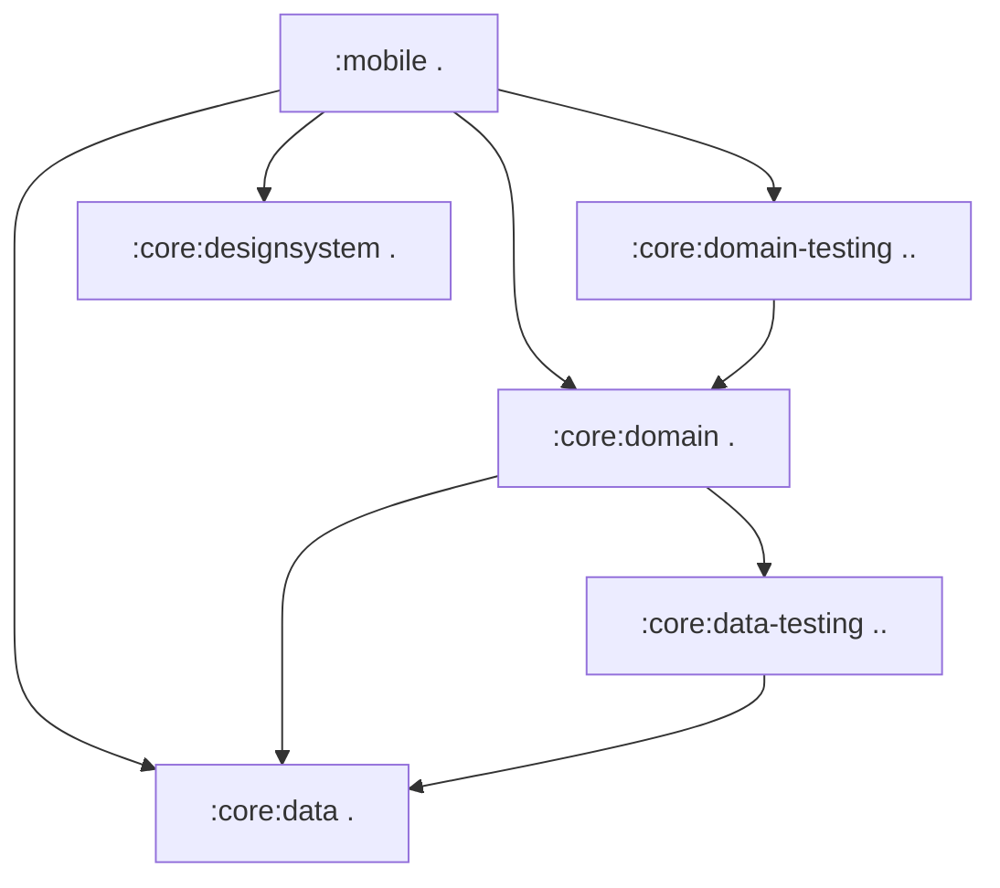
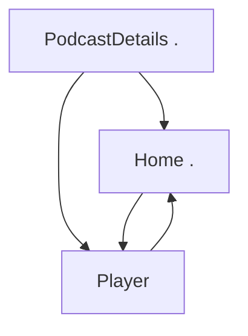

[//]: # (title: Migrating a Jetpack Compose app to Kotlin Multiplatform)

<secondary-label ref="IntelliJ IDEA"/>
<secondary-label ref="Android Studio"/>

<tldr>
<p>This tutorial uses IntelliJ IDEA, but you can also follow it in Android Studio.
   Both IDEs share the same core functionality and Kotlin Multiplatform support.</p>
</tldr>

This guide is about migrating an Android-only app to be multiplatform across the whole stack,
from business logic to UI.
It illustrates common challenges and solutions using an advanced Compose sample.
You can follow the commit sequence closely or skim the general migration steps and dive deeper into any part that interests you.

The starting app is [Jetcaster](https://github.com/android/compose-samples/tree/main/Jetcaster),
a sample podcast app built for Android with Jetpack Compose.
The sample is a fully featured app that relies on:
* Multiple modules.
* Android resource management.
* Network and database access.
* Compose Navigation.
* The latest Material Expressive components.

All of these features can be adapted into a cross-platform app using Kotlin Multiplatform (KMP) and
the Compose Multiplatform UI framework.

> You can jump straight into the [repository for the KMP version of Jetcaster](https://github.com/kotlin-hands-on/jetcaster-kmp-migration).
> Check out the commit history to follow the steps we took to migrate the app from Android-only.
> 
{style="note"}

To prepare to make your Android app work on other platforms, you can:

1. Learn how to evaluate your project as a candidate for Kotlin Multiplatform (KMP) migration.
2. See how to separate Gradle modules into cross-platform and platform-specific modules.
   For Jetcaster, we were able to make most business logic modules multiplatform,
   except for some low-level system calls that needed to be programmed separately for iOS and Android.
3. Follow the process of making business logic modules multiplatform one by one by
   gradually updating build scripts and code to move between working states with minimal changes.
4. See how the UI code transitions to a shared implementation:
   using Compose Multiplatform, you can share most of the UI code in Jetcaster.
   More importantly, you'll see how to implement this transition gradually, screen by screen.

The resulting app runs on Android, iOS, and desktop.
The desktop app also serves as a [Compose Hot Reload](compose-hot-reload.md) example:
a way to quickly iterate on your UI's behavior.

## Checklist for a potential Kotlin Multiplatform migration

The main hurdles for a potential KMP migration are Java and Android Views.
If your project is already written in Kotlin and uses Jetpack Compose for the UI,
it lowers the complexity of a migration considerably.

Here is a general checklist of what preparations you should consider before migrating a project or a module:

1. [Convert or isolate Java code](#convert-or-isolate-java-code)
2. [Check your Android/JVM-only dependencies](#check-your-android-jvm-only-dependencies)
3. [Catch up with modularization technical debt](#catch-up-with-modularization-technical-debt)
4. [Migrate to Compose](#migrate-from-views-to-jetpack-compose)

### Convert or isolate Java code

In the original Android Jetcaster example, there are Java-only calls like `Objects.hash()` and `Uri.encode()`,
along with extensive use of the `java.time` package.

While you can call Java from Kotlin and the other way around,
the `commonMain` source set, which contains the shared code in a Kotlin Multiplatform module, can't contain Java code.
So, when you make your Android app multiplatform, you need to either:
* Isolate this code in `androidMain` (and rewrite it for iOS), or
* Convert the Java code to Kotlin using multiplatform-compatible dependencies.

Another Java-specific library, RxJava, is not used in Jetcaster but is widely adopted. Since it's
a Java framework for managing asynchronous operations,
it's recommended to migrate to `kotlinx-coroutines` before starting a KMP migration.

There are [guides for migrating from Java to Kotlin](https://kotlinlang.org/docs/java-to-kotlin-idioms-strings.html)
as well as a [helper in IntelliJ IDEA](https://www.jetbrains.com/help/idea/get-started-with-kotlin.html#convert-java-to-kotlin)
that can automatically convert Java code and streamline the process.

### Check your Android/JVM-only dependencies

While a lot of projects, especially newer ones, may not include much Java code, they often have Android-only dependencies.
For Jetcaster, identifying alternatives and migrating to them made up most of the work.

An important step is to build a list of dependencies used in the code you plan to share and ensure that multiplatform alternatives are available.
While the multiplatform ecosystem isn't as large as the Java ecosystem, it is expanding rapidly.
Use [klibs.io](https://klibs.io) as a starting point to evaluate potential options.

For Jetcaster, the list of these libraries was as follows:

* Dagger/Hilt, a popular dependency injection solution (replaced with [Koin](https://insert-koin.io/))

  Koin is a reliable multiplatform DI framework. If it doesn't meet your needs or the required rewrite
  is too extensive, there are other solutions.
  The [Metro](https://zacsweers.github.io/metro/latest/) framework is also multiplatform.
  It can help ease the migration by supporting [interop with other annotations](https://zacsweers.github.io/metro/latest/interop/),
  including Dagger and Kotlin Inject.
* Coil 2, an image loading library (which [became multiplatform in version 3](https://coil-kt.github.io/coil/upgrading_to_coil3/)).
* ROME, an RSS framework (replaced with the multiplatform [RSS Parser](https://github.com/prof18/RSS-Parser)).
* JUnit, a test framework (replaced with [kotlin-test](https://kotlinlang.org/api/core/kotlin-test/)).

As you go along, you may find small pieces of code that stop working in multiplatform because there is no cross-platform implementation exists yet.
For example, in Jetcaster, we had to replace the `AnnotatedString.fromHtml()` function, which is part of the Compose UI library,
with a third-party multiplatform dependency.

It's hard to identify all such cases in advance, so be prepared to find replacements or rewrite code during the migration process.
This is why we show how to move from one working state to another in the smallest steps possible. That way, a single issue
won't stall your progress when many parts are changing at once.

### Catch up with modularization technical debt

KMP allows you to migrate to a multiplatform state selectively, module by module, screen by screen.
But for this to work smoothly, your module structure needs to be clear and easy to manipulate.
Consider evaluating your modularization according to the [high cohesion, low coupling principle](https://developer.android.com/topic/modularization/patterns#cohesion-coupling),
along with other recommended practices for structuring modules.

General advice can be summarized as follows:

* Separate distinct parts of the app's functionality into feature modules,
  and keep feature modules separate from data modules, which handle and provide access to data.
* Encapsulate the data and business logic for a specific domain within a module.
  Group related data types together, and avoid mixing logic or data across unrelated domains.
* Prevent outside access to a module’s implementation details and data sources by using Kotlin [visibility modifiers](https://kotlinlang.org/docs/visibility-modifiers.html).

With a clear structure, even if your project has a lot of modules,
you should be able to migrate them to KMP individually. This approach is smoother than attempting a full rewrite.

### Migrate from Views to Jetpack Compose

Kotlin Multiplatform provides Compose Multiplatform as a way to create cross-platform UI code.
To transition smoothly to Compose Multiplatform, your UI code should already be written using Compose. If you're currently using Views,
you'll need to rewrite that code in the new paradigm and using the new framework.
This is obviously easier when done in advance.

Google has been advancing and enriching Compose for a long time. Check out the [Jetpack Compose migration guides](https://developer.android.com/develop/ui/compose/migrate)
for help with the most common scenarios.
You can also use Views-Compose interoperability, but just like with Java code, this code must be isolated in your
`androidMain` source set.

## Steps to make an app multiplatform

After the initial preparations and evaluations are done, the general process is:

1. [Migrate to multiplatform libraries](#migrate-to-multiplatform-libraries)

2. [Transition your business logic to KMP](#migrating-the-business-logic).
   1. Start with a module that has the fewest other modules depending on it.
   2. Migrate it to the KMP module structure and migrate to using multiplatform libraries.
   3. Pick the next module in the dependency tree and repeat the process.
   
   {type="alpha-lower"}
3. [Transition your UI code to Compose Multiplatform](#migrating-to-multiplatform-ui).
   When all of your business logic is already multiplatform, transitioning to Compose Multiplatform becomes relatively
   straightforward.
   For Jetcaster, we show incremental migration by migrating screen by screen/ We also show how to adjust the navigation graph
   when some screens have been migrated and some have not.

To simplify the example, we removed Android-specific Glance, TV, and wearable targets
from the start since they don't interact with multiplatform code anyway and won't need to be migrated.

> You can follow the description of the steps below, or jump straight to the [repository with the final multiplatform Jetcaster project](https://github.com/kotlin-hands-on/jetcaster-kmp-migration/commits/main/).
> Each commit represents a working state of the app, to showcase the potential of a gradual migration from Android-only
> to fully Kotlin Multiplatform.
> 
{style="tip"}

### Prepare the environment {collapsible="true"}

If you'd like to follow the migration steps or run the provided sample on your machine,
make sure you prepare the environment:

1. From the quickstart, complete the instructions to [set up your environment for Kotlin Multiplatform](quickstart.md#set-up-the-environment).

   > You need a Mac with macOS to build and run the iOS application.
   > This is an Apple requirement.
   >
   {style="note"}

2. In IntelliJ IDEA or Android Studio, create a new project by cloning the sample repository:

   ```text
   git@github.com:kotlin-hands-on/jetcaster-kmp-migration.git
   ```

## Migrate to multiplatform libraries

There are a couple of libraries that most of the app's functionality relies on.
We can transition their usage to be KMP-compatible before configuring the modules for multiplatform support:

* Migrate from the ROME tools parser to the multiplatform RSS Parser.
  This requires accounting for differences between the APIs, one of which is how they handle dates.

  > See the [resulting commit](https://github.com/kotlin-hands-on/jetcaster-kmp-migration/commit/703d670ed82656c761ed2180dc5118b89fc9c805).
* Migrate from Dagger/Hilt to Koin 4 throughout the entire app, including the Android-only entry point module `mobile`.
  This requires rewriting the dependency injection logic according to the Koin approach, but code outside `*.di` packages
  remains largely unaffected.

  When you migrate away from Hilt, make sure to clear `/build` directories to avoid compilation errors in previously generated Hilt code.

  > See the [resulting commit](https://github.com/kotlin-hands-on/jetcaster-kmp-migration/commit/9c59808a5e3d74e6a55cd357669b24f77bbcd9c8).

* Upgrade to Coil 3 from Coil 2. Again, relatively little code was modified.

  > See the [resulting commit](https://github.com/kotlin-hands-on/jetcaster-kmp-migration/commit/826fdd2b87a516d2f0bfe6b13ab8e989a065ee7a).

* Migrate from JUnit to `kotlin-test`. This concerns all modules with tests, but thanks to the `kotlin-test` compatibility,
  there are very few changes needed to implement the migration.

  > See the [resulting commit](https://github.com/kotlin-hands-on/jetcaster-kmp-migration/commit/82109598dbfeda9dceecc10b40487f80639c5db4).

### Rewrite Java-dependent code into Kotlin

Now that the major libraries are all multiplatform, we need to eliminate Java-only dependencies.

A simple example of a Java-only call is `Objects.hash()`, which we re-implemented in Kotlin.
See the [resulting commit](https://github.com/kotlin-hands-on/jetcaster-kmp-migration/commit/29341a430e6c98a4f7deaed1d6863edb98e25659).

But what mostly prevents us from directly commonizing code in the Jetcaster example is the `java.time` package.
Time calculation is almost everywhere in a podcast app, so we need to migrate that code to `kotlin.time` and `kotlinx-datetime`
to truly benefit from KMP code sharing.

The rewrite of everything time-related is collected in [this commit](https://github.com/kotlin-hands-on/jetcaster-kmp-migration/commit/0cb5b31964991fdfaed7615523bb734b22f9c755).

## Migrating the business logic

Once the primary dependencies are multiplatform, we can choose a module to start with the migration.
It can be useful to build a dependency graph of the modules in your project.
An AI agent like [Junie](https://www.jetbrains.com//junie/) can easily help with that.
For Jetcaster, the simplified graph of module dependencies looked like this:



This suggests the following sequence, for example:

1. `:core:data`
2. `:core:data-testing`
3. `:core:domain`
4. `:core:domain-testing`
5. `:core:designsystem` — while it doesn't have module dependencies, this is a UI helper module,
   so we tackle it only when we're ready to move UI code into a shared module.

### Configure :core:data and migrate database code

Jetcaster uses [Room](https://developer.android.com/training/data-storage/room) as the database library.
Since Room is multiplatform starting with version 2.7.0,
we only need to update the code to work across platforms.
At this point we don't have the iOS app yet, but we can already write platform-specific code that will be called
when we set up an iOS entry point.
We also add configuration for targets for other platforms (iOS and JVM), to prepare for adding new entry points later.

To switch to the multiplatform version of Room, we followed Android's [general setup guide](https://developer.android.com/kotlin/multiplatform/room).

> See the [resulting commit](https://github.com/kotlin-hands-on/jetcaster-kmp-migration/commit/ab22fb14e9129087b310a989eb08bcc77b0e12e8).

* Note the new code structure, with `androidMain`, `commonMain`, `iosMain`, and `jvmMain` source sets.
* Most of the code changes are about creating expect/actual structure for Room and the corresponding DI changes.
* There is a new `OnlineChecker` interface that is covering for the fact that we only check for internet connectivity
  on Android. Until we [add an iOS app as a target](#add-an-ios-entry-point), the online checker is going to be a stub.

We can also immediately reconfigure the `:core:data-testing` module to be multiplatform.
See the [resulting commit](https://github.com/kotlin-hands-on/jetcaster-kmp-migration/commit/098a72a25f07958b90ae8778081ab1c7f2988543).
It only requires updating the Gradle configuration and moving to the source set
folder structure.

### Configure and migrate :core:domain

If all dependencies are already accounted for and migrated to multiplatform, the only thing we have to do
is move the code and reconfigure the module.

> See the [resulting commit](https://github.com/kotlin-hands-on/jetcaster-kmp-migration/commit/a8376dc2f0eb29ed8b67c929970dcbe505768612).

Similarly to `:core:data-testing`, we can easily update the `:core:domain-testing` module to be multiplatform as well.

> See the [resulting commit](https://github.com/kotlin-hands-on/jetcaster-kmp-migration/commit/a46f0a98b8d95656e664dca0d95da196034f2ec3).

### Configure and migrate :core:designsystem

With only UI code left to migrate, we transition the `:core:designsystem` module into KMP, with the font resources
and typography:
* We configured the module and created the `commonMain` source set.
* We made the `JetcasterTypography` argument for the `MaterialExpressiveTheme` into a composable,
  encapsulating the calls to multiplatform fonts.

> See the [resulting commit](https://github.com/kotlin-hands-on/jetcaster-kmp-migration/commit/4aa92e3f38d06aa64444163d865753e47e9b2a97).

## Migrating to multiplatform UI

When all the `:core` logic is multiplatform, you can start moving UI to common code as well.
Once again, since we're aiming for full migration, we're not adding the iOS target yet, just making sure that the Android app
works with Compose parts placed in common code.

To visualize the logic that we'll follow, here is a simplified diagram that represents relationships between Jetcaster screens:

<!-- The deep link connections and the supporting pane are commented out for the sake of brevity but may be interesting. --> 



Firstly, we created a shared UI module, for the UI code we're going to make common.

> See the [resulting commit](https://github.com/kotlin-hands-on/jetcaster-kmp-migration/commit/a48bb1281c63a235fcc1d80e2912e75ddd5cbed4).

To demonstrate migrating the UI gradually, we'll move screen by screen.
Each step will end in a commit that contains the app in a working state, a little closer to a fully shared UI.

Guided by the screens diagram above, we started with the podcast details screen:

1. The migrated screen will work with the Compose theme still in the Android module.
   What we need to do:
   1. Update the ViewModel and the corresponding DI code.
   2. Update the resources and resource accessors.
      While the multiplatform resources library is closely aligned with the Android experience, there are some
      notable differences that need to be addressed:
      * There are slight differences in how resource files are handled.
        For example, the resource directory needs to be called `composeResources` instead of `res`,
        and `@android:color` usages in Android XML files need to be replaced with color hex-codes.
        See the documentation on [multiplatform resources](compose-multiplatform-resources.md) to learn more.
      * The generated class with resource accessors is called `Res` (as opposed to `R` on Android).
        After you've moved and adjusted the resource files, regenerate the accessors and replace the imports for each resource
        in your UI code.
      
   > See the [resulting commit](https://github.com/kotlin-hands-on/jetcaster-kmp-migration/commit/801f044e56224398d812eb8fd1c1d46b0e9b0087).

2. Migrate the Compose theme. We also provide stubs for platform-specific implementations of color schemes.

   > See the [resulting commit](https://github.com/kotlin-hands-on/jetcaster-kmp-migration/commit/07be9bba96a0dd91e4e0761075898b3d5272ca57).

3. Continue with the home screen:
   1. Migrate the ViewModel.
   2. Move code to `commonMain` in the shared UI module.
   3. Move and adjust references to resources.

   > See the [resulting commit](https://github.com/kotlin-hands-on/jetcaster-kmp-migration/commit/ad0012becc527c1c8cb354bb73b5da9741733a1f).

4. To demonstrate another way to atomize the migration, we partially migrated navigation.
   We can combine screens in common code with an Android native screen.
   The `PlayerScreen` is still located in the `mobile` module, and is included in navigation only for the Android entry point.
   It is injected into the overarching multiplatform navigation.

   > See the [resulting commit](https://github.com/kotlin-hands-on/jetcaster-kmp-migration/commit/2e0107dd4d217346b38cc9b3d5180fedcc12fb8b).
   
5. Finish by moving everything that is left over:
   * Move the rest of navigation over to common code ([resulting commit](https://github.com/kotlin-hands-on/jetcaster-kmp-migration/commit/48f13acc02d3630871e3671114f736cb3db51424)).
   * Migrate the last screen, `PlayerScreen`, to Compose Multiplatform ([resulting commit](https://github.com/kotlin-hands-on/jetcaster-kmp-migration/commit/60d5a2f96943705c869b5726622e873925fc2651)).

Now that all the UI code has been made common, we can use it to quickly create apps for other platforms.

## Optional: Add a JVM entry point

This optional step helps to:
* Show how little effort it takes to create a desktop app out of an Android app that's been made completely multiplatform.
* Showcase [Compose Hot Reload](compose-hot-reload.md), which is currently only supported for desktop targets,
  as a tool for quickly iterating on a Compose UI.

With all the UI code shared, adding a new entry point for a desktop JVM app is a matter
of creating a `main()` function and integrating it with the DI framework.

> See the [resulting commit](https://github.com/kotlin-hands-on/jetcaster-kmp-migration/commit/af033dbf39188ef3991466727d155b988c30f1d3).

## Add an iOS entry point

The iOS entry point requires an iOS project that is linked with the KMP code.

Creating and embedding an iOS app in a KMP project is covered in the [Make your app multiplatform](https://kotlinlang.org/docs/multiplatform/multiplatform-integrate-in-existing-app.html#create-an-ios-project-in-xcode)
tutorial.

> The direct integration method we're using here is the most straightforward but may not be the best for your project.
> See the [overview of iOS integration methods](multiplatform-ios-integration-overview.md) to understand the range of alternatives.
>
{style="note"}

In the iOS app, we need to connect the Swift UI code with our Compose Multiplatform code.
We do that by adding a function that returns a `UIViewController` with the embedded `JetcasterApp` composable to the iOS app.

> See the added iOS project and the corresponding code updates in the [resulting commit](https://github.com/kotlin-hands-on/jetcaster-kmp-migration/commit/2b2c412596e199b140089efc73de03e46f5c1d77).

## Run the app

In the final state of the migrated app, there are run configurations for the initial Android module (`mobile`)
and the new iOS app.
You can run the desktop app from the corresponding `main.kt` file.
Run them both to see the way shared UI works on all platforms!

## Final summary

In this migration, we followed general steps for turning a pure Android app into a Kotlin Multiplatform app:

* Transition to multiplatform dependencies, or rewrite the code where it's not possible.
* Transform Android modules usable on other platforms into multiplatform modules, one by one.
* Create a shared UI module for Compose Multiplatform code, and transition to shared UI code, screen by screen.
* Create entry points for other platforms.

This sequence is not set in stone. It's possible to start with entry points for other platforms,
and gradually build the foundation under them until they work.
In the Jetcaster example, we chose a clearer sequence of changes that is easy to follow step by step.

If you have any feedback on the guide or demonstrated solutions, create an issue in [YouTrack](https://kotl.in/issue). 