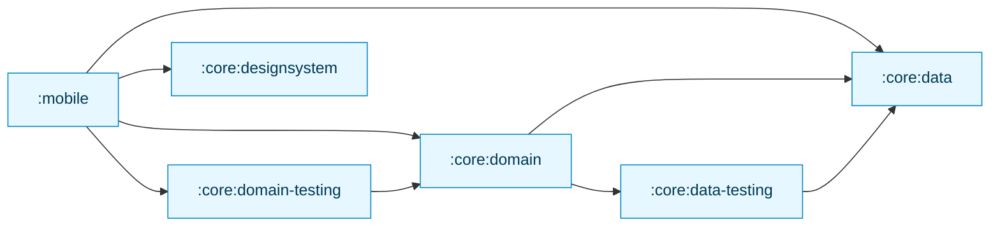
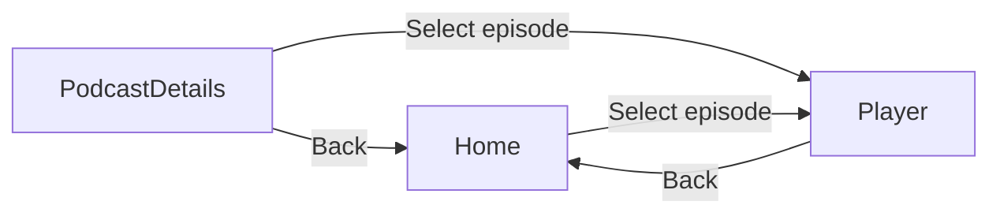

[//]: # (title: Migrating a Jetpack Compose app to Kotlin Multiplatform)

<secondary-label ref="IntelliJ IDEA"/>
<secondary-label ref="Android Studio"/>

<tldr>
<p>This tutorial uses Android Studio, but you can also follow it in IntelliJ IDEA. When <a href="quickstart.md">set up properly</a>,
   both IDEs share the same core functionality and Kotlin Multiplatform support.</p>
</tldr>

This guide is about migrating an Android-only app to multiplatform across the whole stack,
from business logic to UI.
It illustrates general challenges and solutions using an advanced Compose sample.
You can follow the commit sequence closely, or skim through the general steps of the migration and dive deeper
at a particular step.

The starting app is [Jetcaster](https://github.com/android/compose-samples/tree/main/Jetcaster),
a sample podcast app built for Android with Jetpack Compose.
The sample is a fully featured app that relies on:
* multiple modules,
* Android resource management,
* network and database access,
* Compose Navigation.
* latest Material Expressive components.

All of these features can be adapted into a cross-platform app with the help of Kotlin Multiplatform and
the Compose Multiplatform framework.

To make your application work on both iOS and Android, you will:

1. Learn how to evaluate your project as a candidate for a KMP migration.
2. See how to separate Gradle modules into cross-platform and platform-specific.
   For Jetcaster, we were able to make most business logic modules multiplatform,
   except for some lower-lever system calls that need to be programmed separately for iOS and Android.
3. Follow the process of making business logic modules multiplatform one by one:
   gradually updating build scripts and code to move between working states with minimal changes.
4. See the transition to shared UI code:
   using Compose Multiplatform, it's possible to share most of UI code for Jetcaster,
   but more importantly you can see how to implement this transition gradually, screen by screen.

> If you aren't familiar with Kotlin Multiplatform, do learn how to [create and run a cross-platform application from scratch](quickstart.md)
> first.
>
{style="tip"}

The resulting application runs on Android, iOS, and desktop.
The desktop application also serves as a [Compose Hot Reload](compose-hot-reload.md) illustration,
a way to quickly iterate on the way your UI works.

## Prepare environment for development {collapsible="true"}

If you'd like to follow the migration steps or run the provided sample on your machine,
make sure you prepare the environment:

1. From the quickstart, complete the instructions to [set up your environment for Kotlin Multiplatform](quickstart.md#set-up-the-environment).

   > You need a Mac with macOS to build and run the iOS application.
   > This is an Apple requirement. 
   >
   {style="note"}

2. In IntelliJ IDEA, clone the sample repository (TODO do we link the actual repo):

   ```text
   git@github.com:android/compose-samples.git
   ```

3. Select **File | Open** in the main menu of the IDE and open the Jetcaster folder as a project in IntelliJ IDEA (TODO screenshot):

   {width="513"}

## Checklist for a potential Kotlin Mutliplatform migration

The main hurdles for a potential KMP migration are Java and Android Views.
If your project is already written in Kotlin and uses Jetpack Compose as the UI framework,
it lowers the threshold considerably.

Here is a general checklist of what you may need to do before migrating a project or a module:

1. [Convert or isolate Java code](#convert-or-isolate-java-code)
2. [Check your Android/JVM-only dependencies](#check-your-android-jvm-only-dependencies)
3. [Catch up with modularization technical debt](#catch-up-with-modularization-technical-debt)
4. [Migrate to Compose](#migrate-from-views-to-jetpack-compose)

### Convert or isolate Java code

In the original Android Jetcaster example, there are Java-only `Objects.hash()` and `Uri.encode()` calls,
as well as a lot of usages of the `java.time` package.

While you can call Java from Kotlin and vice versa,
the `commonMain` source set that is the actual shared code part of a Kotlin Multiplatform module, cannot contain Java code.
Therefore, when making your Android app multiplatform you have to either isolate such code to `androidMain`
(and rewrite it for iOS),
or convert Java code to Kotlin — ideally using multiplatform dependencies before even starting the KMP migration.

Another Java-specific library that Jetcaster doesn't depend on but is fairly popular, is RxJava,
a Java framework for managing asynchronous operations.
It is recommended to move to `kotlinx-coroutines` before starting a KMP migration.

There are [guides on migrating to Kotlin from Java](https://kotlinlang.org/docs/java-to-kotlin-idioms-strings.html)
as well as a [helper in IntelliJ IDEA](https://www.jetbrains.com/help/idea/get-started-with-kotlin.html#convert-java-to-kotlin)
that can convert Java code automatically and streamline the process.

### Check your Android/JVM-only dependencies

While a lot of projects, especially newer ones, may not have a lot of Java code, there are definitely a lot of Android-only dependencies.
For Jetcaster, figuring out how to replace such libraries and migrating to them constituted the bulk of the job we needed to do.

So the important step here is to build a list of dependencies for the code you are hoping to share and make sure there
are multiplatform counterparts.
While the multiplatform ecosystem is not as vast as Java, it is expanding rapidly.
Use [klibs.io](https://klibs.io) as your starting point for evaluating potential options.

For Jetcaster, the list of these libraries was as follows:

* Dagger/Hilt, the popular dependency injection solution (replaced with [Koin](https://insert-koin.io/))

  Koin is a tried and true multiplatform DI framework, but if it doesn't satisfy your needs, or the required rewrite
  is too extensive, there are other solutions.
  The [Metro] framework is also multiplatform, and it can make the migration smoother through [interop with other annotations](https://zacsweers.github.io/metro/latest/interop/),
  with Dagger and Kotlin Inject specifically supported.
* Coil 2, the image loading library (which [became multiplatform with version 3](https://coil-kt.github.io/coil/upgrading_to_coil3/))
* ROME, the RSS framework (replaced with the multiplatform [RSS Parser](https://github.com/prof18/RSS-Parser))
* JUnit, the test framework (replaced with [kotlin-test](https://kotlinlang.org/api/core/kotlin-test/))

As you go along, you may find small pieces of code that stop working in multiplatform because there is no cross-platform implementation yet:
for example, in Jetcaster, we had to replace the `AnnotatedString.fromHtml()` function, which is a part of the Compose UI library,
with a third-party multiplatform dependency.

It's hard to figure out all such cases in advance, so be ready to find replacements or rewrite such code after the migration already starts.
This is why we try to show how to move from one working state of a project making the smallest steps possible,
so a hiccup would not stall your progress with a lot of parts moving at the same time.

### Catch up with modularization technical debt

KMP allows you to migrate to a multiplatform state selectively, module by module, screen by screen.
But for this to work smoothly, your module structure needs to be clear and easy to manipulate.
Consider evaluating your modularization according to the [high cohesion, low coupling principle](https://developer.android.com/topic/modularization/patterns#cohesion-coupling),
for example, and related recommendations on module structure.

General advice can be summarized as follows:

* Separate distinct parts of the app's functionality into feature modules,
  and separate feature modules from data modules (concerned with handling and providing access to data).
* Encapsulate data and business logic of a certain domain in a module.
  Related data types should be consolidated, but different domains should not cross-contaminate.
* Hide implementation details and data sources of a module from outside access by using Kotlin [visibility modifiers](https://kotlinlang.org/docs/visibility-modifiers.html).

With a clear structure, even if you have a lot of modules,
you should be able to migrate them to KMP individually, which should be smoother than going through a sweeping rewrite.

### Migrate from Views to Jetpack Compose

Kotlin Multiplatform offers Compose Multiplatform as means to create cross-platform UI code.
But to easily transition to Compose Multiplatform your UI code should already be written using Compose — if you are using Views,
you will have to rewrite it in the new paradigm and the new framework.
This obviously is easier when done in advance.

Google has been advancing and enriching Compose for a long time, check out [Jetpack Compose migration guides](https://developer.android.com/develop/ui/compose/migrate)
for most common scenarios.
You can make use of Views-Compose interoperability, but as with Java code, this will have to be isolated in your
`androidMain` source set.

## Steps to make an app multiplatform

After the initial preparations and evaluations are done, the general process is:

1. [Transition your business logic to KMP](#migrating-the-business-logic).
   1. Pick a module with the least number of your project modules depending on it.
   2. Migrate it to KMP module structure and migrate to using multiplatform libraries.
   3. Pick the next module in the dependency tree and repeat.
   
   {type="alpha-lower"}
2. [Transition your UI code to Compose Multiplatform](#migrating-to-multiplatform-ui).
   When all of your business logic is already multiplatform, transitioning to Compose Multiplatform is relatively
   straightforward.
   For Jetcaster, we show incremental migration: how to migrate screen by screen, and how to adjust the navigation graph
   when some screens are migrated and some are not.

> To simplify the example, we removed Android-specific Glance, TV, and wearable targets
> in the very beginning since they don't interact with multiplatform code anyway and won't need to be migrated.
> 
{style="note"}

## Migrating the business logic

To choose a module to start with, it's useful to build a dependency graph of the modules in your project.
For Jetcaster, it looked like this:



This suggests the following sequence, for example:

1. `:core:data`
2. `:core:data-testing`
3. `:core:designsystem`
4. `:core:domain`
5. `:core:domain-testing`

### Migrate to multiplatform libraries

There are a couple of libraries that most of the app functionality relies on.
We can transition their usage to be KMP-compatible before actually configuring any modules to be multiplatform:

* Migrate from the ROME tools parser to the multiplatform RSS Parser.
  This requires to account for differences between the APIs, one of which is handling dates.
  
  > See the [resulting commit](https://github.com/zamulla/compose-samples/pull/3/commits/c2280bb6df0da407984b8afcbeb947a071b33b84). 
* Migrate from Dagger/Hilt to Koin 4 in the entire app, including Android-only entry point module `mobile`.
  This requires rewriting the dependency injection logic according to the Koin approach, but code outside `*.di` packages
  remains largely unaffected.

  > See the [resulting commit](https://github.com/zamulla/compose-samples/pull/3/commits/f1c757dac5efa377226f15675bb580b10ee86c6a).

  Koin is a tried and true multiplatform DI framework, but if it doesn't satisfy your needs, or the required rewrite
  is too extensive, there are other solutions.
  The [Metro] framework is also multiplatform, and it can make the migration smoother through [interop with other annotations](https://zacsweers.github.io/metro/latest/interop/),
  with Dagger and Kotlin Inject specifically supported.
* Migrate from JUnit to `kotlin-test`. This concerns all modules with tests, but thanks to `kotlin-test` compatibility,
  there are very little changes needed to implement the migration.
  
  > See the [resulting commit](https://github.com/zamulla/compose-samples/pull/3/commits/9250b1081b2557cb60aa887900fc66c3ff3a6bee).
* Upgrade to Coil 3 from Coil 2. Again, relatively little code modified.
 
  > See the [resulting commit](https://github.com/zamulla/compose-samples/pull/3/commits/0a437a4d1579cf64f09e72278d1e67b9f59ebcca).

### Rewrite Java-dependent code into Kotlin

Now that the major libraries are all multiplatform, we get rid of Java dependencies.

In the Jetcaster example, what mostly prevents us from directly commonizing code is the `java.time` package.
Time calculation is almost everywhere in a podcast app, so we need to migrate that code to `kotlin.time` and `kotlinx-datetime`
to be able to better benefit from KMP code sharing.

The rewrite of everything time-related is collected in [this commit](https://github.com/zamulla/compose-samples/pull/1/commits/f125720bdabb64b16291574fb03cc1655b039946).

Another exclusively Java API is the `Objects.hash()` call which we had to quickly re-implement in Kotlin:
see the [resulting commit](https://github.com/zamulla/compose-samples/pull/1/commits/cb75696694237cd6d1dff5ff8934b2452fdb35b1).

### Migrate :core:data

#### Migrate to a multiplatform RSS library

This can be done before `:core:data` is configured to be multiplatform.
The RSS reader is not involved with other modules, so we can tie this migration to `:core:data` directly.

> See the [commit with the corresponding rewrite](https://github.com/zamulla/compose-samples/pull/3/commits/c2280bb6df0da407984b8afcbeb947a071b33b84).

#### Configure :core:data and migrate database code

Jetcaster uses Room as the database library. Since Room is multiplatform from version 2.7.0,
we only need to update the code to work across platforms.
At this point we don't have the iOS app yet, but we can already write platform-specific code that will be called
when we set up an iOS entry point.

To switch to the multiplatform Room, we followed the [general setup guide](https://developer.android.com/kotlin/multiplatform/room)
available in the Android documentation. 

> See the [resulting commit](https://github.com/zamulla/compose-samples/pull/3/commits/7c4364a65a3577538a678daf989663f6ca55c9d3):

* Note the new code structure, with `androidMain`, `commonMain`, `iosMain`, and `jvmMain` source sets.
* Most of the code changes are about creating expect/actual structure for Room and corresponding DI changes.
* There is a new `OnlineChecker` interface that is covering for the fact that we only check for internet connectivity
  on Android. Until we [add an iOS app as a target](#add-an-ios-entry-point), the online checker is going to be a stub.

We can also immediately reconfigure `:core:data-testing` module to be multiplatform.
See the [resulting commit](https://github.com/zamulla/compose-samples/pull/3/commits/6d6af83bb15b846c83020a59948bde6aaf79e609):
it doesn't need anything more than to update the Gradle configuration and move to the source set
folder structure.

#### Configure and migrate :core:designsystem

For `:core:designsystem`, we:

1. Configured the KMP module and move code and resources into `commonMain`.
2. Made the `JetcasterTypography` argument for a `MaterialExpressiveTheme` into a composable, encapsulating the calls to
   multiplatform fonts.

> See the [resulting commit](https://github.com/zamulla/compose-samples/pull/3/commits/e929161aca3b0436e9bdbe4049ae59f3f14dab1a).

#### Configure and migrate :core:domain

If all dependencies are already accounted for and migrated to multiplatform, the only thing we have to do here
is move the code and reconfigure the module.

> See the [resulting commit](https://github.com/zamulla/compose-samples/pull/3/commits/a2f29a8d9fb969d194cdb937913fcf6878a03d0a).

Similarly to `:core:data-testing`, we can easily update the `:core:domain-testing` to be multiplatform as well.

> See the [resulting commit](https://github.com/zamulla/compose-samples/pull/3/commits/0643d8fa7ddd0458ff403084e6fc4d0dda77c18f)).

## Migrating to multiplatform UI

When all the `:core` logic is multiplatform, you can start moving UI to common code as well.
Once again, since we're aiming for full migration, we're not adding the iOS target yet, just making sure that the Android app
works with Compose parts placed in common code.

To visualize the logic that we'll follow, here is a simplified diagram that represents relationships between Jetcaster screens:

<!-- The deep link connections and the supporting pane are commented out for the sake of brevity but may be interesting. --> 



To demonstrate migrating UI gradually (the links lead to corresponding GitHub commits):
1. Migrate one screen to Compose Multiplatform, which will work with the Compose theme still in the Android module.
   We start with the podcast details screen:
   1. [Update the ViewModel and the corresponding DI code](https://github.com/zamulla/compose-samples/pull/3/commits/531633fbcda8d22eac8036b0241faf17bdc8c1a6#diff-488213e3596fa0e794ba90a72423cc8d9368f4ffa4d900002ef1b52777f24e76).
   2. While the multiplatform resources library is closely aligned with the Android experience, there are some
      notable differences that need to be addressed:
      * There are slight differences in how resource files are handled.
        For example, the resource directory needs to be called `composeResources` instead of `res`,
        and `@android:color` usages in Android XML files won't work and need to be replaced with color hex-codes.
        See the documentation on [multiplatform resources](compose-multiplatform-resources.md) to learn more.
      * The generated class with resource accessors is called `Res` (as opposed to `R` on Android).
        After you moved and adjusted the resource files, regenerate the accessors and replace the imports for each resource
        in your UI code.
      
      > See the [commit with these changes made for the Jetcaster app](https://github.com/zamulla/compose-samples/pull/3/commits/b534de30c63bbc4214230affe14233fc832de11d).

2. [Migrate the Compose theme](https://github.com/zamulla/compose-samples/pull/3/commits/4bbabbadf418ba9eccfc569a4db970d64cdb6459).
   Note the platform-specific implementations of color schemes.
3. Migrate another screen, this time the home page:
   1. [Migrate the ViewModel](https://github.com/zamulla/compose-samples/pull/3/commits/a6af9c05903e9f88332cb1a2d14acf50defc6019).
   2. [Move code to commonMain](https://github.com/zamulla/compose-samples/pull/3/commits/9229d115b98964e10d583341ed10bc2821aadccb)
   3. [Move and adjust references to resources](https://github.com/zamulla/compose-samples/pull/3/commits/57cc44394a07ae3ff1ee93450a038f7f42d569df)
4. Partially migrate navigation to showcase combining multiplatform screens with an Android native screen (see [resulting commit](https://github.com/zamulla/compose-samples/pull/3/commits/0f9f6e95c0eead62937df4896b17f9e0cf4537e7)).
   This way `PlayerScreen` is still in the `mobile` module, and is included in navigation only for the Android entry point,
   being injected in the overarching multiplatform navigation.
5. Finalize by moving everything that is left over:
   * [Move the rest of navigation over to common code](https://github.com/zamulla/compose-samples/pull/3/commits/1ff3edaf759635ab546eb00bb445b1890389f0d1).
   * [Migrate the last screen, `PlayerScreen`, to Compose Multiplatform](https://github.com/zamulla/compose-samples/pull/3/commits/c0ac6b306d5de0314b539eaae6d560969d094418).

## Add a JVM entry point

This is an optional step, but this helps:
* show how little effort it takes to create a desktop app out of the Android app that has been made comprehensively multiplatform,
* showcase Compose Hot Reload, which is currently only supported for desktop targets, as a tool of quick iteration on building a Compose UI.

Since we've done everything we could to share code up to this point, adding a new entry point for a desktop JVM app is a matter
of creating a `main()` function and integrating it with the DI framework (see [resulting commit](https://github.com/zamulla/compose-samples/pull/3/commits/7c67078d13338648e661f353ef8bdc3bbb700e53)).

## Add an iOS entry point

The general sequence here is as follows:

### Create a base iOS app using Xcode

Create an iOS app project to serve as a KMP entry point:

1. In Xcode, select **File | New | Project** in the main menu.
2. Select the **iOS** tab, then the **App** template, and click **Next**:

   
3. Name the project `iosApp` and click **Next**.
4. As the location for your project, select the root directory of your Kotlin Multiplatform project.

> The direct integration method we're using here is the most straightforward, but may not be the best for your project.
> See the [overview of iOS integration methods](multiplatform-ios-integration-overview.md) to understand the range of alternatives.
>
{style="note"}

### Update the iOS-specific code

Connect the Kotlin code with the iOS app:

1. In the `sharedUI/src/iosMain/kotlin/com/example/jetcaster/shared/` folder, create a `MainViewController.kt` file
   with the function that will provide a `UIViewController` to the iOS app.
2. In the `ContenView.swift` file of the iOS project, call that function to provide content to the `ContentView` structure.
3. In the `core/data/src/iosMain` source set, add an iOS-specific implementation for the `OnlineChecker` interface.

> See the iOS project and the corresponding code updates in the [resulting commit](https://github.com/zamulla/compose-samples/pull/3/commits/7a0bfa55c436a869cbabbd1718a5da02249850e2).

### Run the app

The Kotlin Multiplatform IDE plugin recognizes an iOS entry point and creates a new run configuration automatically.
Run the app on the device of your choice to see that the app runs on iOS just as it does on Android

If the run configuration wasn't generated automatically, you can add one manually:

1. In the run configurations dropdown, select **Edit Configurations**.
2. Click **+** and select the **Xcode Application** type.
3. Select the target iOS project in the **Target** field and click **OK**.

<!-- This commit should be broken up into these two parts exactly. -->

## Final summary

In this migration, we have followed general steps for turning a pure Android app into a Kotlin Multiplatform app:

* Transition to multiplatform dependencies, or rewrite the code where it's not possible.
* Transform Android modules usable on other platforms into multiplatform modules, one by one.
* Create a shared UI module for Compose Multiplatform code, and transition to shared UI code, screen by screen.
* Create entry points for other platforms.

The sequence is not set in stone: It's possible to start with entry points for other platforms,
and gradually build the foundation under them until they work.
For this guide we opted for a clearer sequence of changes.
If you have any feedback on the guide or demonstrated solutions, please create an issue on [YouTrack](https://kotl.in/issue). 