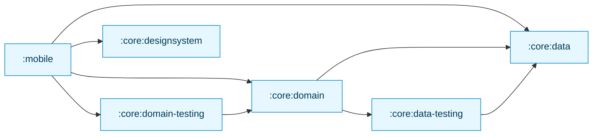

[//]: # (title: Migrating a Jetpack Compose app to Kotlin Multiplatform)

<secondary-label ref="IntelliJ IDEA"/>
<secondary-label ref="Android Studio"/>

<tldr>
<p>This tutorial uses Android Studio, but you can also follow it in IntelliJ IDEA. When <a href="quickstart.md">set up properly</a>,
   both IDEs share the same core functionality and Kotlin Multiplatform support.</p>
</tldr>

This guide talks about general problems about making your Android app multiplatform,
illustrating solutions to some of these problems with an advanced Compose sample.
You can follow the commit sequence closely, or overview general steps of a migration and dive deeper
at a particular step.

The starting app is [Jetcaster](https://github.com/android/compose-samples/tree/main/Jetcaster),
a sample podcast app built for Android with Jetpack Compose.
The sample is fully featured, showcasing resource management, network access, and navigation,
as well as the latest Material Expressive components that you can make cross-platform
using the Compose Multiplatform framework.

To make your application work on both iOS and Android, you will:

1. Learn how to evaluate your project as a candidate for a KMP migration.
2. See how to separate modules into potentially cross-platform and platform-specific.
   For Jetcaster, we were able to make most business logic modules multiplatform,
   except for some lower-lever system calls that need to be programmed separately for iOS and Android.
3. Follow the process of making business logic modules multiplatform one by one:
   gradually updating build scripts and code to move between working states with minimal changes.
4. See the transition to shared UI code:
   using Compose Multiplatform, it's possible to share most of UI code for Jetcaster,
   but more importantly you can see how to implement this transition gradually, screen by screen.

> If you aren't familiar with Kotlin Multiplatform, do learn how to [create and run a cross-platform application from scratch](quickstart.md)
> first.
>
{style="tip"}

The resulting application runs on Android, iOS, and desktop.
The desktop target mostly serves as a [Compose Hot Reload](compose-hot-reload.md) illustration,
but it is also functional.

## Prepare environment for development {collapsible="true"}

If you'd like to follow the migration steps or run the provided sample on your machine,
make sure you prepare the environment:

1. From the quickstart, complete the instructions to [set up your environment for Kotlin Multiplatform](quickstart.md#set-up-the-environment).

   > You need a Mac with macOS to run the .
   > This is an Apple requirement. 
   >
   {style="note"}

2. In IntelliJ IDEA, clone the sample repository (TODO do we link the actual repo):

   ```text
   git@github.com:android/compose-samples.git
   ```

3. Select **File | Open** in the main menu of the IDE and open the Jetcaster folder as a project in IntelliJ IDEA (TODO screenshot):

   {width="513"}

## Checklist for a potential KMP migration

If your project is a relatively modern Android app, it is likely to already satisfy most requirements.
But this is a useful list to evaluate older or complex projects.

The general steps are:
1. Pick a module that can be made multiplatform.
2. Make sure all its dependencies are multiplatform.
3. Reconfigure the module and lay out the code in source sets.
4. Reconfigure the project.

What can you do in advance to make these steps smoother?

### Convert or isolate Java code

While you can call Java from Kotlin and vice versa,
the `commonMain` source set, that is the actual shared code part of a Kotlin Multiplatform module, cannot contain Java code.
Therefore, when making your Android app multiplatform you have to either isolate such code to `androidMain`
(and rewrite it for iOS),
or convert Java code to Kotlin.

There are [guides on migrating to Kotlin from Java](https://kotlinlang.org/docs/java-to-kotlin-idioms-strings.html)
as well as a [helper in IntelliJ IDEA](https://www.jetbrains.com/help/idea/get-started-with-kotlin.html#convert-java-to-kotlin)
that can convert Java code automatically and streamline the process.

### Check your Android/JVM-only dependencies

While a lot of projects, especially newer ones, may not have a lot of Java code, there are definitely a lot of Android-only dependencies.
For Jetcaster, figuring out how to replace such libraries and migrating to them constituted the bulk of the job we needed to do.

So the important step here is to build a list of dependencies for the code you are hoping to share and make sure there
are multiplatform counterparts.
While the multiplatform ecosystem is not as vast as Java, if only because it is harder to make a multiplatfrom library,
it is expanding rapidly.
Use [klibs.io](https://klibs.io) as your starting point for evaluating potential options.

For Jetcaster, the list of these libraries was as follows:

* Dagger/Hilt, the popular dependency injection solution (replaced with [Koin](https://insert-koin.io/))
* Coil 2, the image loading library (which [became multiplatform with version 3](https://coil-kt.github.io/coil/upgrading_to_coil3/))
* ROME, the RSS framework (replaced with the multiplatform [RSS Parser](https://github.com/prof18/RSS-Parser))
* JUnit, the test framework (replaced with [kotlin-test](https://kotlinlang.org/api/core/kotlin-test/))

As you go along, you may find small pieces of code that stop working in multiplatform because there is no cross-platform implementation yet:
for example, in Jetcaster, we had to replace the `AnnotatedString.fromHtml()` function, which is a part of the Compose UI library,
with a third-party multiplatform dependency.

It's hard to figure out all such cases in advance, so be ready to find replacements or rewrite such code after the migration already starts.
This is why we try to show how to move from one working state of a project making the smallest steps possible,
so a hiccup would not stall your progress with a lot of parts moving at the same time.

### Catch up with modularization technical debt

KMP allows you to migrate to a multiplatform state selectively, module by module, screen by screen.
But for this to work smoothly, your module structure needs to be clear and easy to manipulate.
Consider evaluating your modularization according to the [high cohesion, low coupling principle](https://developer.android.com/topic/modularization/patterns#cohesion-coupling),
for example, and related recommendations on module structure.

With a clear structure, even if you have a lot of modules,
you should be able to migrate modules to KMP individually and therefore smoother than going through a sweeping rewrite.

### Migrate to Compose

Kotlin Multiplatform offers Compose Multiplatform as means to create cross-platform UI code.
But to easily transition to Compose Multiplatform your UI code should already be written using Compose — if you are using Views,
you will have to rewrite it in the new paradigm and the new framework.
This obviously is easier when done in advance.

Google has been advancing and enriching Compose for a long time, check out [Jetpack Compose migration guides](https://developer.android.com/develop/ui/compose/migrate)
for most common scenarios.
You can make use of Views-Compose interoperability, but as with Java code, this will have to be isolated in your
`androidMain` source set.

## Steps to make an app multiplatform

After the initial preparations and evaluations are done, the general process is:

1. Transition your business logic to KMP.
   1. Pick a module with the least number of your project modules depending on it.
   2. Reconfigure it and migrate to using multiplatform libraries.
   3. Pick the next module in the dependency tree and repeat.
2. Transition your UI code to Compose Multiplatform.
   When all of your business logic is already multiplatform, transitioning to Compose Multiplatform is relatively
   straightforward.
   For Jetcaster, we show incremental migration: how to migrate screen by screen, and how to adjust the navigation graph
   when some screens are migrated and some are not.

> To simplify the example, we removed Android-specific Glance, TV, and wearable targets
> in the very beginning since they don't interact with multiplatform code anyway and won't need to be migrated.
> 
{style="note"}

To choose a module to start with, it's useful to build a dependency graph of the modules in your project.
For Jetcaster, it looked like this:



This suggests the following sequence, for example:

1. :core:data
2. :core:data-testing
3. :core:designsystem
4. :core:domain
5. :core:domain-testing

### Migrate to multiplatform libraries

As mentioned above, there are a couple of big libraries that we can transition to in advance, before configuring multiplatform modules:

* Migrate from Dagger/Hilt to Koin 4 in the entire app, including Android-only entry point module `mobile`.
  This requires rewriting the dependency injection logic according to the Koin approach, but code outside of `*.di` packages
  remains largely unaffected. See the [resulting commit](https://github.com/zamulla/compose-samples/pull/3/commits/f1c757dac5efa377226f15675bb580b10ee86c6a).
* Migrate from JUnit to `kotlin-test`. This concerns all modules with tests, but thanks to `kotlin-test` compatibility,
  there are very little changes needed to implement the migration. See the [resulting commit](https://github.com/zamulla/compose-samples/pull/3/commits/9250b1081b2557cb60aa887900fc66c3ff3a6bee).
* Upgrade to Coil 3 from Coil 2. Again, relatively little code modified. See the [resulting commit](https://github.com/zamulla/compose-samples/pull/3/commits/0a437a4d1579cf64f09e72278d1e67b9f59ebcca).

### Migrate :core:data

#### Migrate to a multiplatform RSS library

This can be done before `:core:data` is configured to be multiplatform.
The RSS reader is not involved with other modules, so we can tie this migration to `:core:data` directly.

See the [commit with the corresponding rewrite](https://github.com/zamulla/compose-samples/pull/3/commits/c2280bb6df0da407984b8afcbeb947a071b33b84).

#### Configure :core:data and migrate database code

Jetcaster uses Room as the database library. Since Room is multiplatform from version 2.7.0,
we only need to update the code to work across platforms.
At this point we don't have the iOS app yet, but we can already write platform-specific code that will be called
when we set up an iOS entry point.

See the [resulting commit](https://github.com/zamulla/compose-samples/pull/3/commits/7c4364a65a3577538a678daf989663f6ca55c9d3):
* Note the new code structure, with `androidMain`, `commonMain`, `iosMain`, and `jvmMain` source sets.
* Most of the code changes are about creating expect/actual structure for Room and corresponding DI changes.
* There is a new `OnlineChecker` interface that is covering for the fact that we only check for internet connectivity
  on Android. We will add an iOS implementation later on.

We can also immediately reconfigure `:core:data-testing` module to be multiplatform.
See the [resulting commit](https://github.com/zamulla/compose-samples/pull/3/commits/6d6af83bb15b846c83020a59948bde6aaf79e609):
it doesn't need anything more than to update the Gradle configuration and move to the source set
folder structure.

### Migrate to multiplatform UI

When all the `:core` logic is multiplatform, you can start moving UI to common code as well.
Once again, since we're aiming for full migration, we're not adding the iOS target yet, just making sure that the Android app
works with Compose parts placed in common code.

To demonstrate migrating UI gradually, we will:
1. Migrate one screen to Compose Multiplatform, which will work with the Compose theme still in the Android module.
   We start with the podcast details screen:
   1. [Update the ViewModel and the corresponding DI code](https://github.com/zamulla/compose-samples/pull/3/commits/531633fbcda8d22eac8036b0241faf17bdc8c1a6#diff-488213e3596fa0e794ba90a72423cc8d9368f4ffa4d900002ef1b52777f24e76).
   2. [Move the code and resources to commonMain](https://github.com/zamulla/compose-samples/pull/3/commits/b534de30c63bbc4214230affe14233fc832de11d)
2. Migrate the Compose theme (see [resulting commit](https://github.com/zamulla/compose-samples/pull/3/commits/4bbabbadf418ba9eccfc569a4db970d64cdb6459)).
   Note the platform-specific implementations of color schemes.
3. Migrate another screen, this time the home page:
   1. [Migrate the ViewModel](https://github.com/zamulla/compose-samples/pull/3/commits/a6af9c05903e9f88332cb1a2d14acf50defc6019).
   2. [Move code to commonMain](https://github.com/zamulla/compose-samples/pull/3/commits/9229d115b98964e10d583341ed10bc2821aadccb)
   3. [Move and adjust references to resources](https://github.com/zamulla/compose-samples/pull/3/commits/57cc44394a07ae3ff1ee93450a038f7f42d569df)
4. Partially migrate navigation to showcase combining multiplatform screens with an Android native screen (see [resulting commit](https://github.com/zamulla/compose-samples/pull/3/commits/0f9f6e95c0eead62937df4896b17f9e0cf4537e7)).
   This way `PlayerScreen` is still in the `mobile` module, and is included in navigation only for the Android entry point,
   being injected in the overarching multiplatform navigation.
5. Finalize by moving everything that is left over:
   * Move the rest of navigation over to common code ([resulting commit](https://github.com/zamulla/compose-samples/pull/3/commits/1ff3edaf759635ab546eb00bb445b1890389f0d1)).
   * Migrate the last screen, `PlayerScreen`, to Compose Multiplatform ([resulting commit](https://github.com/zamulla/compose-samples/pull/3/commits/c0ac6b306d5de0314b539eaae6d560969d094418)).

### Add a JVM entry point

This is an optional step, but this helps:
* show how little effort it takes to create a desktop app out of the Android app that has been made comprehensively multiplatform,
* showcase Compose Hot Reload, which is currently only supported for desktop targets, as a tool of quick iteration on building a Compose UI.

Since we've done everything we could to share code up to this point, adding a new entry point for a desktop JVM app is a matter
of creating a `main()` function and integrating it with the DI framework (see [resulting commit](https://github.com/zamulla/compose-samples/pull/3/commits/7c67078d13338648e661f353ef8bdc3bbb700e53)).

### Add an iOS entry point

The general sequence here is as follows:

1. Create a template Xcode project for an iOS app.
2. Put it inside your multiplatform project.
3. Create a `MainViewController` in `iosMain` and call it from the Swift code to connect the iOS app with the XCFramework
   produced by KMP.

See the [resulting commit](https://github.com/zamulla/compose-samples/pull/3/commits/7a0bfa55c436a869cbabbd1718a5da02249850e2)
which brings Jetcaster to life on iOS!

> The direct integration method is the most straightforward, but may not be the best for your project.
> See the [overview of iOS integration methods](multiplatform-ios-integration-overview.md) to understand the range of alternatives.
> 
{style="note"}