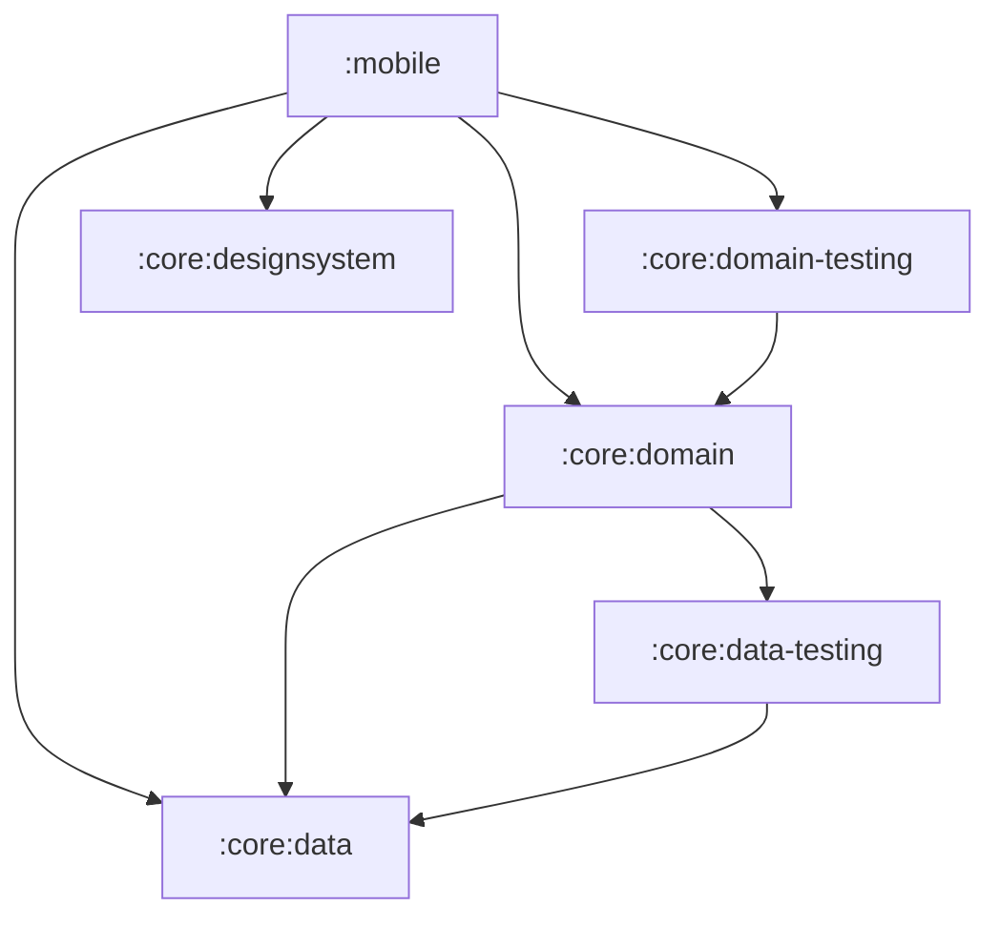
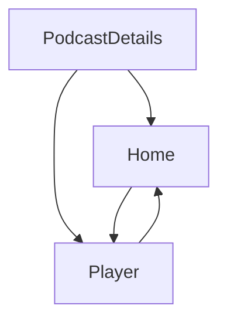

[//]: # (title: Migrating a Jetpack Compose app to Kotlin Multiplatform)

<secondary-label ref="IntelliJ IDEA"/>
<secondary-label ref="Android Studio"/>

<tldr>
<p>This tutorial uses IntelliJ IDEA, but you can also follow it in Android Studio.
   Both IDEs share the same core functionality and Kotlin Multiplatform support.</p>
</tldr>

This guide is about migrating an Android-only app to be multiplatform across the whole stack,
from business logic to UI.
It illustrates common challenges and solutions using an advanced Compose sample.
You can follow the commit sequence closely or skim the general migration steps and dive deeper into any part that interests you.

The starting app is [Jetcaster](https://github.com/android/compose-samples/tree/main/Jetcaster),
a sample podcast app built for Android with Jetpack Compose.
The sample is a fully featured app that relies on:
* Multiple modules.
* Android resource management.
* Network and database access.
* Compose Navigation.
* The latest Material Expressive components.

All of these features can be adapted into a cross-platform app using Kotlin Multiplatform and
the Compose Multiplatform framework.

To prepare to make your Android app work on other platforms, you can:

1. Learn how to evaluate your project as a candidate for Kotlin Multiplatform (KMP) migration.
2. See how to separate Gradle modules into cross-platform and platform-specific modules.
   For Jetcaster, we were able to make most business logic modules multiplatform,
   except for some low-level system calls that needed to be programmed separately for each platform.
3. Follow the process of making business logic modules multiplatform one by
   gradually updating build scripts and code to move between working states with minimal changes.
4. See how the UI code transitions to a shared implementation:
   using Compose Multiplatform, you can share most of the UI code in Jetcaster.
   More importantly, you'll see how to implement this transition gradually, screen by screen.

The resulting app runs on Android, iOS, desktop, and in the browser.
The desktop app also serves as a [Compose Hot Reload](compose-hot-reload.md) example:
a way to quickly iterate on your UI's behavior.

## Checklist for a potential Kotlin Multiplatform migration

The main hurdles for a potential KMP migration are Java and Android Views.
If your project is already written in Kotlin and uses Jetpack Compose for the UI,
it lowers the complexity of a migration considerably.

Here is a general checklist of what preparations you should consider before migrating a project or a module:

1. [Convert or isolate Java code](#convert-or-isolate-java-code)
2. [Check your Android/JVM-only dependencies](#check-your-android-jvm-only-dependencies)
3. [Catch up with modularization technical debt](#catch-up-with-modularization-technical-debt)
4. [Migrate to Compose](#migrate-from-views-to-jetpack-compose)

### Convert or isolate Java code

In the original Android Jetcaster example, there are Java-only calls like `Objects.hash()` and `Uri.encode()`,
along with extensive use of the `java.time` package.

While you can call Java from Kotlin and the other way around,
the `commonMain` source set, which contains the shared code in a Kotlin Multiplatform module, can't contain Java code.
So, when you make your Android app multiplatform, you need to either:
* Isolate this code in `androidMain` (and rewrite it for the other platforms), or
* Convert the Java code to Kotlin using multiplatform-compatible dependencies.

Another Java-specific library, RxJava, is not used in Jetcaster but is widely adopted. Since it's
a Java framework for managing asynchronous operations,
it's recommended to migrate to `kotlinx-coroutines` before starting a KMP migration.

There are [guides for migrating from Java to Kotlin](https://kotlinlang.org/docs/java-to-kotlin-idioms-strings.html)
as well as a [helper in IntelliJ IDEA](https://www.jetbrains.com/help/idea/get-started-with-kotlin.html#convert-java-to-kotlin)
that can automatically convert Java code and streamline the process.

### Check your Android/JVM-only dependencies

While a lot of projects, especially newer ones, may not include much Java code, they often have Android-only dependencies.
For Jetcaster, identifying alternatives and migrating to them made up most of the work.

An important step is to build a list of dependencies used in the code you plan to share and ensure that multiplatform alternatives are available.
While the multiplatform ecosystem isn't as large as the Java ecosystem, it is expanding rapidly.
Use [klibs.io](https://klibs.io) as a starting point to evaluate potential options.

For Jetcaster, the list of these libraries was as follows:

* Dagger/Hilt, a popular dependency injection solution (replaced with [Koin](https://insert-koin.io/))

  Koin is a reliable multiplatform DI framework. If it doesn't meet your needs or the required rewrite
  is too extensive, there are other solutions.
  The [Metro](https://zacsweers.github.io/metro/latest/) framework is also multiplatform.
  It can help ease the migration by supporting [interop with other annotations](https://zacsweers.github.io/metro/latest/interop/),
  including Dagger and Kotlin Inject.
* Coil 2, an image loading library (which [became multiplatform in version 3](https://coil-kt.github.io/coil/upgrading_to_coil3/)).
* ROME, an RSS framework (replaced with the multiplatform [RSS Parser](https://github.com/prof18/RSS-Parser)).
* JUnit, a test framework (replaced with [kotlin-test](https://kotlinlang.org/api/core/kotlin-test/)).
* OkHttp, an HTTP client (no longer needed directly: RSS Parser and Coil 3 make their own calls,
  and Coil 3 has a [Ktor-based](https://ktor.io/) network layer for platforms where OkHttp isn't available).

As you go along, you may find small pieces of code that stop working in multiplatform because no cross-platform
implementation exists yet.
For example, in Jetcaster we had to replace two Android-only APIs with third-party multiplatform libraries:

* `AnnotatedString.fromHtml()`, which is part of the Compose UI library but is only implemented for Android
  (replaced with [htmlconverter](https://github.com/cbeyls/HtmlConverterCompose)).
* `android.net.Uri`, used to encode navigation arguments
  (replaced with [uri-kmp](https://github.com/eygraber/uri-kmp)).

It's hard to identify all such cases in advance, so be prepared to find replacements or rewrite code during the migration process.
This is why we show how to move from one working state to another in the smallest steps possible. That way, a single issue
won't stall your progress when many parts are changing at once.

### Catch up with modularization technical debt

KMP allows you to migrate to a multiplatform state selectively, module by module, screen by screen.
But for this to work smoothly, your module structure needs to be clear and easy to manipulate.
Consider evaluating your modularization according to the [high cohesion, low coupling principle](https://developer.android.com/topic/modularization/patterns#cohesion-coupling),
along with other recommended practices for structuring modules.

General advice can be summarized as follows:

* Separate distinct parts of the app's functionality into feature modules,
  and keep feature modules separate from data modules, which handle and provide access to data.
* Encapsulate the data and business logic for a specific domain within a module.
  Group related data types together, and avoid mixing logic or data across unrelated domains.
* Prevent outside access to a module's implementation details and data sources by using Kotlin [visibility modifiers](https://kotlinlang.org/docs/visibility-modifiers.html).

With a clear structure, even if your project has a lot of modules,
you should be able to migrate them to KMP individually. This approach is smoother than attempting a full rewrite.

### Migrate from Views to Jetpack Compose

Kotlin Multiplatform provides Compose Multiplatform as a way to create cross-platform UI code.
To transition smoothly to Compose Multiplatform, your UI code should already be written using Compose. If you're currently using Views,
you'll need to rewrite that code in the new paradigm and using the new framework.
This is obviously easier when done in advance.

Google has been advancing and enriching Compose for a long time. Check out the [Jetpack Compose migration guides](https://developer.android.com/develop/ui/compose/migrate)
for help with the most common scenarios or try the [agent skill to migrate with AI](https://github.com/android/skills/blob/main/jetpack-compose/migration/migrate-xml-views-to-jetpack-compose/SKILL.md).
You can also use Views-Compose interoperability, but just like with Java code, this code must be isolated in your
`androidMain` source set.

## Steps to make an app multiplatform

After the initial preparations and evaluations are done, the general process is:

1. [Migrate to multiplatform libraries](#migrate-to-multiplatform-libraries)

2. [Transition your business logic to KMP](#migrating-the-business-logic).
   1. Start with a module that has the fewest other modules depending on it.
   2. Migrate it to the KMP module structure and migrate to using multiplatform libraries.
   3. Pick the next module in the dependency tree and repeat the process.
   
   {type="alpha-lower"}
3. [Transition your UI code to Compose Multiplatform](#migrating-to-multiplatform-ui).
   When all of your business logic is already multiplatform, transitioning to Compose Multiplatform becomes relatively
   straightforward.
   For Jetcaster, we show incremental migration by migrating screen by screen. We also show how to adjust the navigation graph
   when some screens have been migrated and some have not.
4. [Add entry points](#add-a-jvm-entry-point) for the platforms you want to support.

To simplify the example, we removed Android-specific Glance, TV, and wearable targets
from the start since they don't interact with multiplatform code anyway and won't need to be migrated.
That trimming, along with the Gradle and AGP versions the rest of the migration relies on, is collected
in a single [preparation commit](https://github.com/kotlin-hands-on/jetcaster-kmp-migration/commit/0ed6355fc6c66d9284c571b3164ad06b3e8f2da5).

> You can follow the description of the steps below or jump straight to the
> [step-by-step-migration branch](https://github.com/kotlin-hands-on/jetcaster-kmp-migration/commits/step-by-step-migration/)
> of the Jetcaster sample repository, which is the history this guide walks through.
> Each commit represents a working state of the app, to showcase the potential of a gradual migration from Android-only
> to fully Kotlin Multiplatform. The repository's `main` branch holds the same project in its final state.
> 
{style="tip"}

### Prepare the environment {collapsible="true"}

If you'd like to follow the migration steps or run the provided sample on your machine,
make sure you prepare the environment:

1. From the quickstart, complete the instructions to [set up your environment for Kotlin Multiplatform](quickstart.md#set-up-the-environment).

   > As per Apple requirement, you need a Mac with macOS and Xcode to build and run the iOS application.
   >
   {style="note"}

2. In IntelliJ IDEA or Android Studio, create a new project by cloning the sample repository:

   ```text
   git@github.com:kotlin-hands-on/jetcaster-kmp-migration.git
   ```

   To follow the migration commit by commit, check out the `step-by-step-migration` branch.
   The `main` branch holds the same project in its final state and is updated independently,
   although the final state of both branches is functionally the same.

3. The sample's modules use a Java 17 toolchain, so Gradle needs a JDK 17 available in addition to the JDK
   it runs on itself. If the build fails with `Cannot find a Java installation … matching {languageVersion=17}`,
   install a JDK 17 or configure [toolchain provisioning](https://docs.gradle.org/current/userguide/toolchains.html#sec:provisioning).

## Migrate to multiplatform libraries

There are a couple of libraries that most of the app's functionality relies on.
We can transition their usage to be KMP-compatible before configuring the modules for multiplatform support:

* Migrate from the ROME tools parser to the multiplatform RSS Parser.
  This requires accounting for differences between the APIs: RSS Parser makes its own network calls,
  so OkHttp is not needed anymore,
  but publication dates and episode durations now have to be parsed by hand.

  > See the [resulting commit](https://github.com/kotlin-hands-on/jetcaster-kmp-migration/commit/3c7e4fbad9aed7353cf53271ec2792e11cf43c2a).
* Migrate from Dagger/Hilt to Koin 4 throughout the entire app, including the Android-only entry point module `mobile`.
  This requires rewriting the dependency injection logic according to the Koin approach, but code outside `*.di` packages
  remains largely unaffected.

  When you migrate away from Hilt, make sure to clear `/build` directories to avoid compilation errors in previously generated Hilt code.

  This step also illustrates the cost of an Android-only dependency in a different way: Hilt's annotation processor
  can't read Kotlin 2.4 metadata, so the project can't move to the latest Kotlin until Hilt is gone.
  Once it is, the Kotlin version goes up in the same commit.

  > See the [resulting commit](https://github.com/kotlin-hands-on/jetcaster-kmp-migration/commit/07ef8fdb985de9fe27c83382c22e8244c48f5e4b).

* Upgrade to Coil 3 from Coil 2. Again, relatively little code was modified: the `coil.*` packages become `coil3.*`,
  and image loading works against Coil's own `PlatformContext` instead of an Android `Context`.

  > See the [resulting commit](https://github.com/kotlin-hands-on/jetcaster-kmp-migration/commit/d2e5cb3e6e5df2d83e2c8d4abb554c010c9beef4).

* Migrate from JUnit to `kotlin-test`. This concerns all modules with tests, but thanks to the `kotlin-test` compatibility,
  there are very few changes needed to implement the migration.

  > See the [resulting commit](https://github.com/kotlin-hands-on/jetcaster-kmp-migration/commit/145d22221525c7ea4d138c6392c8c0336bca763b).

* Replace `AnnotatedString.fromHtml()`, which renders the HTML in podcast descriptions, with the multiplatform
  `htmlconverter` library. This function is part of the Compose UI library, but it's only implemented for Android.

  > See the [resulting commit](https://github.com/kotlin-hands-on/jetcaster-kmp-migration/commit/658748208ceb36442f5c9969aa599f04277ffe90).

### Rewrite Java-dependent code into Kotlin

Now that the major libraries are all multiplatform, we need to eliminate Java-only dependencies.

A simple example of a Java-only call is `Objects.hash()`, which we re-implemented in Kotlin.

> See the [resulting commit](https://github.com/kotlin-hands-on/jetcaster-kmp-migration/commit/343ec4d7f89089ba8451b873cc3b4263adbe4297).

But what mostly prevents us from directly commonizing code in the Jetcaster example is the `java.time` package.
Time calculation is almost everywhere in a podcast app, so we need to migrate that code to `kotlin.time` and `kotlinx-datetime`
to truly benefit from KMP code sharing.
For example, there is no built-in parser for the RFC 1123 format in `kotlinx-datetime`,
but you can put one together using the library's format builders.

> Everything time-related is rewritten in [this commit](https://github.com/kotlin-hands-on/jetcaster-kmp-migration/commit/e658e0cfd6538fb146bda4edabcb2818a634cfff).

## Migrating the business logic

Once the primary dependencies are multiplatform, we can choose a module to start with the migration.
It can be useful to build a dependency graph of the modules in your project.
An AI agent like [Junie](https://www.jetbrains.com//junie/) can easily help with that.
For Jetcaster, the simplified graph of module dependencies looked like this:


```mermaid
flowchart TB
  %% Style for modules
  %% classDef Module fill:#e6f7ff,stroke:#0086c9,stroke-width:1px,color:#003a52

  %% Modules
  M_MOBILE[":mobile"]
  M_CORE_DATA[":core:data"]
  M_CORE_DATA_TESTING[":core:data-testing"]
  M_CORE_DOMAIN[":core:domain"]
  M_CORE_DOMAIN_TESTING[":core:domain-testing"]
  M_CORE_DESIGNSYSTEM[":core:designsystem"]

  class M_MOBILE,M_CORE_DATA,M_CORE_DATA_TESTING,M_CORE_DOMAIN,M_CORE_DOMAIN_TESTING,M_CORE_DESIGNSYSTEM Module

  %% Internal dependencies between modules
  %% :mobile
  M_MOBILE --> M_CORE_DATA
  M_MOBILE --> M_CORE_DESIGNSYSTEM
  M_MOBILE --> M_CORE_DOMAIN
  M_MOBILE --> M_CORE_DOMAIN_TESTING

  %% :core:domain
  M_CORE_DOMAIN --> M_CORE_DATA
  M_CORE_DOMAIN --> M_CORE_DATA_TESTING

  %% :core:data-testing
  M_CORE_DATA_TESTING --> M_CORE_DATA

  %% :core:domain-testing
  M_CORE_DOMAIN_TESTING --> M_CORE_DOMAIN

  %% :core:designsystem and :core:data have no intra-project dependencies
```

This suggests the following sequence, for example:

1. `:core:data`
2. `:core:data-testing`
3. `:core:domain`
4. `:core:domain-testing`
5. `:core:designsystem` — while it doesn't have module dependencies, this is a UI helper module,
   so we tackle it only when we're ready to move UI code into a shared module. 

### What changes in a module's build script

Every module migration in this section follows the same pattern, so it's worth looking at it once.
Here is an Android library module before the migration and the same module as a Kotlin Multiplatform
library afterward:

<compare type="top-bottom">
<code-block lang="kotlin">
plugins {
    alias(libs.plugins.android.library)
}

android {
    namespace = "com.example.jetcaster.core.data"
}

dependencies {
    // Dependency example
    implementation(libs.koin.core)
}
</code-block>
<code-block lang="kotlin">
plugins {
    alias(libs.plugins.kotlin.multiplatform)
    alias(libs.plugins.android.kotlin.multiplatform.library)
}

kotlin {
    android {
        namespace = "com.example.jetcaster.core.data"
    }

    jvmToolchain(17)
    iosArm64()
    iosSimulatorArm64()
    jvm()
    wasmJs { browser() }

    sourceSets {
        commonMain.dependencies {
            // Dependency example
            implementation(libs.koin.core)
        }
    }
}
</code-block>
</compare>

Alongside the build script, the module's sources move from `src/main/java` to `src/commonMain/kotlin`,
with `src/androidMain/kotlin`, `src/iosMain/kotlin`, `src/jvmMain/kotlin`, and `src/wasmJsMain/kotlin`
holding the platform-specific parts.

This is the final shape of the script. In the commits below, each module declares only the targets that
exist at that point: `wasmJs` is added later, together with the [web entry point](#add-a-web-entry-point).

Neither module sets `compileSdk` or `minSdk`. Since AGP 9 you can declare those once for every
Android module in `settings.gradle.kts`, which is what Jetcaster does:

```kotlin
plugins {
    id("com.android.settings") version "9.1.0"
}

android {
    compileSdk {
        version = release(37) { minorApiLevel = 0 }
    }
    minSdk = 23
}
```

> Spell out the SDK's minor version. A bare `compileSdk = 37` makes the build look for a platform
> called `android-37`, while the SDK installs API 37 as `android-37.0`. Gradle resolves that
> mismatch, but the IDE may not, and then none of your modules get a compilation target.
>
{style="note"}

### Migrate :core:data

#### Configure :core:data and migrate database code

Jetcaster uses [Room](https://developer.android.com/training/data-storage/room) as the database library.
Room has been multiplatform since version 2.7.0, so we only need to update the code to work across platforms.
At this point we don't have an iOS or a desktop app yet, but we can already write platform-specific code that will be called
when we set up the other entry points.
We also add configuration for targets for the other platforms, so that the platform code compiles from now on.

To switch to the multiplatform version of Room, we followed Android's [general setup guide](https://developer.android.com/kotlin/multiplatform/room).

> See the [resulting commit](https://github.com/kotlin-hands-on/jetcaster-kmp-migration/commit/09e4105297c1144da1b76489f32a0859cf116b1f).

* Note the new code structure, with `androidMain`, `commonMain`, `iosMain`, and `jvmMain` source sets.
* Most of the code changes are about creating expect/actual structure for Room and the corresponding DI changes.
  Creating the database is platform-specific, so `getDatabaseBuilder()` is an expect/actual pair, wired in through an
  `expect val platformDataModule` Koin module.
* `DateTimeTypeConverters` disappears: with `kotlinx-datetime`, the conversions live in the entities themselves.
* The new `OnlineChecker` interface covers for the fact that we only check for internet connectivity
  on Android. Until we [add an iOS app as a target](#add-an-ios-entry-point), the online checker is going to be a stub.

We can also immediately reconfigure the `:core:data-testing` module to be multiplatform.
See the [resulting commit](https://github.com/kotlin-hands-on/jetcaster-kmp-migration/commit/5e1b80fb6efd323c7995b0e399c46ed43a193e45).
It only requires updating the Gradle configuration and moving to the source set
folder structure.

#### Configure and migrate :core:domain

If all dependencies are already accounted for and migrated to multiplatform, the only thing we have to do
is move the code and reconfigure the module. The tests move to `commonTest` and start running on every target
instead of only on the JVM.

> See the [resulting commit](https://github.com/kotlin-hands-on/jetcaster-kmp-migration/commit/24af6f041b4fd4eea373c4c885a763eb78f3458c).

Similarly to `:core:data-testing`, we can easily update the `:core:domain-testing` module to be multiplatform as well.

> See the [resulting commit](https://github.com/kotlin-hands-on/jetcaster-kmp-migration/commit/b984de561a374fe9de3faf409223fa4b3208b179).

#### Configure and migrate :core:designsystem

With only UI code left to migrate, we start transitioning the `:core:designsystem` module, with the font resources
and typography.
This is the first module with Compose code in it, so it's also the first one where Jetpack Compose artifacts
(`androidx.compose.*`) are replaced with Compose Multiplatform ones (`org.jetbrains.compose.*`).

Apart from configuring the KMP module and creating the `commonMain` source set, we made the `JetcasterTypography` argument
for the `MaterialExpressiveTheme` into a composable, encapsulating the calls to multiplatform fonts.

> See the [resulting commit](https://github.com/kotlin-hands-on/jetcaster-kmp-migration/commit/d296e519089aa3e7f68f337d5c282f06959f98f1).

## Migrating to multiplatform UI

When all the `:core` logic is multiplatform, you can start moving UI to common code as well.
Once again, since we're aiming for full migration, we're not adding the other entry points yet, just making sure that the Android app
works with Compose parts placed in common code.

To visualize the logic that we'll follow, here is a simplified diagram that represents relationships between Jetcaster screens:

<!-- The deep link connections and the supporting pane are commented out for the sake of brevity but may be interesting. --> 


```mermaid
---
config:
  labelBackground: '#ded'
---
flowchart TB
  %% Nodes (plain labels, no quotes/parentheses/braces)
  %% Start[Start]
  Home[Home]
  Player[Player]
  PodcastDetailsRoute[PodcastDetails]
  %% DeepLinkEpisodes[Deep link to player]
  %% DeepLinkPodcasts[Deep link to podcast]

  %% Home’s supporting pane represented as a subgraph
  %% subgraph HomeSupportingPane
    %% direction LR
    %% HomeMain[Home main content]
    %% PodcastDetailsPane[PodcastDetails in supporting pane]
  %% end

  %% Start and primary navigation
  %% Start --> Home

  %% Home main actions
  Home --> Player
  %% Home -->|Select podcast| PodcastDetailsPane

  %% From PodcastDetails (supporting pane) actions
  %% PodcastDetailsPane --> Player
  %% PodcastDetailsPane --> Home

  %% Standalone routes (deep links)
  %% DeepLinkEpisodes --> Player
  %% DeepLinkPodcasts --> PodcastDetailsRoute

  %% From standalone PodcastDetails route
  PodcastDetailsRoute --> Player
  PodcastDetailsRoute --> Home

  %% Back behavior from Player (returns to previous context)
  Player --> Home
  %% Player -->|Back| PodcastDetailsPane
```

Firstly, we created a shared UI module, for the UI code we're going to make common.

> See the [resulting commit](https://github.com/kotlin-hands-on/jetcaster-kmp-migration/commit/78383ec300d972e4bb38a49f0b511f3a67518100).

To demonstrate migrating the UI gradually, we'll move screen by screen.
Each step will end in a commit that contains the app in a working state, a little closer to a fully shared UI.

Guided by the screens diagram above, we started with the podcast details screen:

1. The migrated screen will work with the Compose theme still in the Android module.
   What we need to do:
   1. Update the ViewModel and the corresponding DI code.
   2. Update the resources and resource accessors.
      While the multiplatform resources library is closely aligned with the Android experience, there are some
      notable differences that need to be addressed:
      * There are slight differences in how resource files are handled.
        For example, the resource directory needs to be called `composeResources` instead of `res`,
        and `@android:color` usages in Android XML files need to be replaced with color hex-codes.
        See the documentation on [multiplatform resources](compose-multiplatform-resources.md) to learn more.
      * The generated class with resource accessors is called `Res` (as opposed to `R` on Android).
        After you've moved and adjusted the resource files, regenerate the accessors and replace the imports for each resource
        in your UI code.
   3. Switch `koinViewModel()` from the Android-specific `org.koin.androidx.compose` package to the
      multiplatform `org.koin.compose.viewmodel` one.
   4. Replace `android.net.Uri`, which the screen uses to encode the podcast URI it navigates with,
      with the `uri-kmp` equivalent.
      
   > See the [resulting commit](https://github.com/kotlin-hands-on/jetcaster-kmp-migration/commit/3e6f0e45dc59e45f7cb24d2d72c76ab116381c4e).

2. Migrate the Compose theme.
   Android's dynamic color needs `LocalContext` and an API-level check, so the color scheme
   becomes an expect/actual function, with stubs on the other platforms.

   > See the [resulting commit](https://github.com/kotlin-hands-on/jetcaster-kmp-migration/commit/2fa460f2ff15ef46c67ab73fe31f0ea287d92f8e).

3. Continue with the home screen:
   1. Migrate the ViewModel.
   2. Move code to `commonMain` in the shared UI module.
   3. Move and adjust references to resources.
   4. Replace Android-only preview tooling. `@DevicePreviews`, which is built on `androidx.compose.ui.tooling.preview.Devices`,
      is replaced with the multiplatform `@Preview`.

   > See the [resulting commit](https://github.com/kotlin-hands-on/jetcaster-kmp-migration/commit/50519d106499ae45d33beb952d78a95a9342ab1e).

4. To demonstrate another way to atomize the migration, we partially migrate navigation:
   We can combine screens in common code with an Android native screen.
   The `PlayerScreen` is still located in the `mobile` module and is included in navigation only for the Android entry point.
   It is injected into the overarching multiplatform navigation.

   > See the [resulting commit](https://github.com/kotlin-hands-on/jetcaster-kmp-migration/commit/411a2ec84817dc830bc0351e0338023fbff9528f).
   
5. Finish by moving everything that is left over:
   * Move the rest of navigation over to common code ([resulting commit](https://github.com/kotlin-hands-on/jetcaster-kmp-migration/commit/c9a0a260fe07a9ca57e87f554d2d6345f10720f5)).
   * Migrate the last screen, `PlayerScreen`, to Compose Multiplatform ([resulting commit](https://github.com/kotlin-hands-on/jetcaster-kmp-migration/commit/8e3f08cae8cf72d22093689219a7814e9685eb1c)).

     This is the screen with genuinely Android-specific behavior: it switches between a one-pane and a two-pane layout
     depending on folds and hinges. That decision is extracted into an expect/actual composable, so Android keeps the
     posture-aware version while the other platforms only look at the window width.

Now that all the UI code has been made common, we can use it to quickly create apps for other platforms.

At this point the module names have outlived their meaning: `:core` isn't a set of core Android libraries any more,
and `:mobile` is about to stop being the only entry point.
We renamed them to `:sharedLogic` and `:androidApp`.

> See the [resulting commit](https://github.com/kotlin-hands-on/jetcaster-kmp-migration/commit/2749781d4924c9b1983f410a0af273430f6a6fb5).

## Add a JVM entry point

This step helps to:
* Show how little effort it takes to create a desktop app out of an Android app that's been made completely multiplatform.
* Showcase [Compose Hot Reload](compose-hot-reload.md), which is currently only supported for desktop targets,
  as a tool for quickly iterating on a Compose UI.

With all the UI code shared, adding a new entry point for a desktop JVM app is a matter
of creating a `main()` function and integrating it with the DI framework.
The JVM implementations that the shared modules need are already in place from the module migrations.

> See the [resulting commit](https://github.com/kotlin-hands-on/jetcaster-kmp-migration/commit/4f8ab7e7be13ffc81b1a3ffbfcb6595854749fd7).

## Add an iOS entry point

The iOS entry point requires an iOS project linked with the KMP code.

Creating and embedding an iOS app in a KMP project is covered in the [Make your app multiplatform](https://kotlinlang.org/docs/multiplatform/multiplatform-integrate-in-existing-app.html#create-an-ios-project-in-xcode)
tutorial.

> The direct integration method we're using here is the most straightforward but may not be the best for your project.
> See the [overview of iOS integration methods](multiplatform-ios-integration-overview.md) to understand the range of alternatives.
>
{style="note"}

In the iOS app, we need to connect the Swift UI code with our Compose Multiplatform code.
We do that by adding a function that returns a `UIViewController` with the embedded `JetcasterApp` composable to the iOS app.

Now that there's an iOS app to run, the `OnlineChecker` stub is replaced with a real implementation based on the
multiplatform [konnectivity](https://github.com/plusmobileapps/konnectivity) library.

<!-- this probably needs more rigorous verification -->
> Commit a *shared* Xcode scheme (`YourApp.xcodeproj/xcshareddata/xcschemes/`) rather than relying on
> the one Xcode generates for you.
> Generated schemes land in `xcuserdata`, which is normally set to be ignored by Git,
> in which case `xcodebuild -scheme YourApp` can fail with "does not contain a scheme named YourApp"
> on any machine where Xcode has generated its own.
>
{style="tip"}

> See the added iOS project and the corresponding code updates in the [resulting commit](https://github.com/kotlin-hands-on/jetcaster-kmp-migration/commit/9601e8724745b13e94ce210579fa4d0502d96f56).

## Add a web entry point

The browser is the target that asks for the most platform-specific work: it has no JVM, no file system,
and it enforces the same-origin policy. Each of these constraints is a good illustration of how far a single
`expect`/`actual` pair can take you:

* **Database.** SQLite can't touch the file system directly, so it runs inside a web worker backed by the
  [Origin Private File System](https://developer.mozilla.org/en-US/docs/Web/API/File_System_API/Origin_private_file_system).
  The module gains an npm package with the worker, uses `androidx.sqlite:sqlite-web`, and creating the driver
  becomes an expect/actual function instead of always returning the bundled driver.
  OPFS also needs cross-origin isolation headers, which the webpack configuration adds.
* **Dispatchers.** `Dispatchers.IO` doesn't exist on Kotlin/Wasm, so obtaining the IO dispatcher becomes
  an expect/actual function too.
* **Network access.** Browsers enforce CORS, and not every podcast feed sends the right headers,
  so even the list of sample feeds is an `expect val` and the web build uses a shorter list.
  Coil and RSS Parser use the Ktor JS client on this target.

> See the [resulting commit](https://github.com/kotlin-hands-on/jetcaster-kmp-migration/commit/7f2acab35b4adfa447b11a85c1ab536a1805cf46).

## Clean up the Android module

Now that the Android module only contains an application entry point,
we can clean up the unnecessary dependencies leaving only some Compose-specific imports for handling the activity
and the `@Preview` annotation.

> See the [resulting commit](https://github.com/kotlin-hands-on/jetcaster-kmp-migration/commit/061b181d009ca859272a5bcf0c6b2be9c2ddc78b).

## Run the app

In the final state of the migrated app, there are run configurations for the initial Android module (`androidApp`)
and the new iOS app.
You can run the desktop app from the corresponding `main.kt` file, and the web app with the
`:wasmApp:wasmJsBrowserDevelopmentRun` Gradle task.
Run them all to see the way the shared UI works on every platform!

## Final summary

In this migration, we followed general steps for turning a pure Android app into a Kotlin Multiplatform app:

* Transition to multiplatform dependencies, or rewrite the code where it's not possible.
* Transform Android modules usable on other platforms into multiplatform modules, one by one.
* Create a shared UI module for Compose Multiplatform code, and transition to shared UI code, screen by screen.
* Create entry points for other platforms.

This sequence is not set in stone. It's possible to start with entry points for other platforms,
and gradually build the foundation under them until they work.
In the Jetcaster example, we chose a clearer sequence of changes that is easy to follow step by step.

If you have any feedback on the guide or demonstrated solutions, create an issue in [YouTrack](https://kotl.in/issue).
